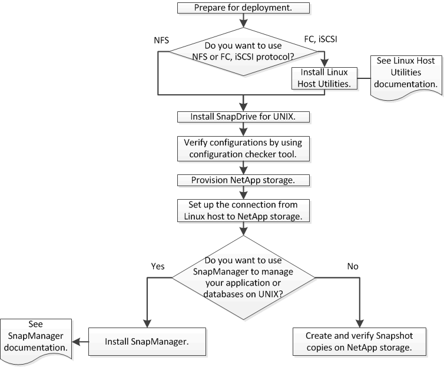

= Flujo de trabajo de implementación
:allow-uri-read: 
:icons: font
:imagesdir: ../media/

[role="lead"]
Antes de poder crear copias Snapshot con SnapDrive, debe instalar utilidades de host Linux (si usa protocolo FC o iSCSI), instalar SnapDrive para UNIX, comprobar las configuraciones compatibles con SnapDrive, aprovisionar el almacenamiento y, a continuación, configurar la conexión desde el host Linux con el sistema de almacenamiento de NetApp.

